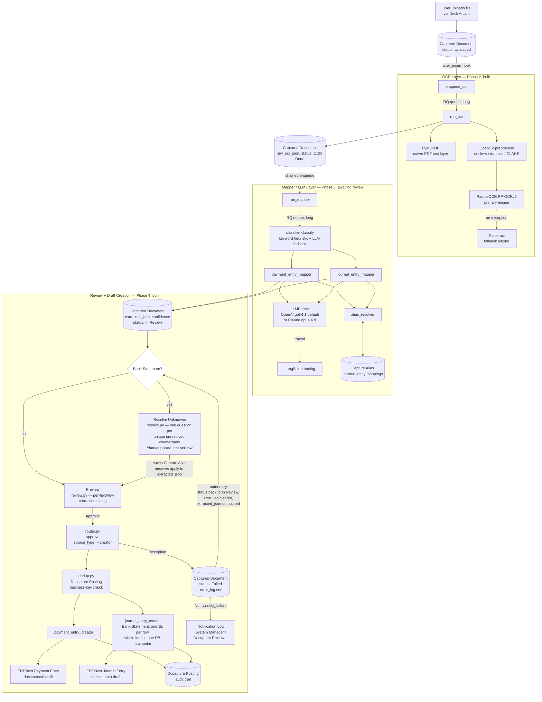

# docapture — Data-Flow Architecture Diagram

Component/data-flow view of the pipeline: how a document moves through the
system. For the class-level view (modules, methods, per-phase namespaces)
see `UML_DIAGRAM.md`. Snapshot, not auto-synced — regenerate by hand when
the pipeline changes. Every phase shown here is built (Phase 4 included);
there is nothing left planned/dashed in this diagram.

