# docapture — UML Class Diagram (by Phase)

Generated from the codebase (`docapture/ocr/*`, doctypes) plus
`PHASED_DEVELOPMENT.md` / `PHASE_STATUS.md`. Namespaces = phases. Solid
boxes = built; grey dashed = planned (Phase 3/4, not started).

Regenerate by hand when a phase's code changes — this is a snapshot, not
auto-synced.

```mermaid
---
title: docapture — UML Class Diagram by Phase
---
classDiagram
    direction TB

    %% Phase 0 -- Scaffold (Approved)
    namespace Phase0_Scaffold {
        class hooks_py["hooks.py"] {
            +doc_events
            +after_insert
        }
        class install_py["install.py"]
    }

    %% Phase 1 -- Capture doctype + upload + status (Approved)
    namespace Phase1_CaptureDoctype {
        class CapturedDocument {
            +file
            +content_hash
            +status
            +source_type
            +raw_ocr_json
            +error_log
            +validate()
            +check_file_type()
            +set_content_hash()
            +check_duplicate()
        }
        class CaptureAlias {
            +entity_type
            +normalized_value
            +company
            +validate()
            +check_duplicate()
        }
        class CapturedDocumentStatus {
            <<enumeration>>
            Uploaded
            OCR_Done
            Parsed
            In_Review
            Approved
            Posted
            Rejected
            Failed
        }
    }

    %% Phase 2 -- OCR layer, ocr/* (Approved)
    namespace Phase2_OCRLayer {
        class OCREngine {
            <<Protocol>>
            +extract_page(image, dpi) dict
        }
        class schema_module["schema.py"] {
            +make_page(...) dict
            +make_document(pages, dpi) dict
            +to_native(value)
            +round_bbox(bbox)
            +TARGET_DPI
        }
        class pymupdf_extractor {
            +has_text_layer(page) bool
            +rasterize_page(page, dpi)
            +extract_document(file_bytes, dpi)
        }
        class preprocess {
            +to_grayscale(image)
            +ensure_min_dpi(image, min_dpi)
            +correct_orientation_coarse(gray)
            +deskew(gray)
            +denoise(gray)
            +enhance_contrast(gray)
            +threshold(gray)
            +correct_perspective(image)
            +preprocess_page(image, source_type) tesseract_input
            +preprocess_for_paddle(image, source_type) paddle_input
        }
        class paddle_engine {
            +extract_page(image, dpi) dict
        }
        class tesseract_engine {
            +extract_page(image, dpi) dict
        }
        class pipeline_module["pipeline.py"] {
            +enqueue_ocr(doc, method)
            +run_ocr(captured_document)
            +extract_captured_document(doc) dict
            -_resolve_page(page_result, source_type)
        }
    }

    %% Phase 3 -- Mapper / LLM layer, mappers/* (Not Started)
    namespace Phase3_MapperLLM {
        class LLMParser {
            <<Protocol, planned>>
        }
        class classifier["classifier (planned)"]
        class payment_entry_mapper["payment_entry_mapper (planned)"]
        class journal_entry_mapper["journal_entry_mapper (planned)"]
        class alias_resolver["alias resolver (planned)"]
    }

    %% Phase 4 -- Review queue + draft creation (Not Started)
    namespace Phase4_ReviewDraft {
        class router["router registry (planned)"]
        class payment_entry_creator["payment_entry_creator (planned)"]
        class journal_entry_creator["journal_entry_creator (planned)"]
    }

    CapturedDocument --> CapturedDocumentStatus : status

    paddle_engine ..|> OCREngine : realizes
    tesseract_engine ..|> OCREngine : realizes
    pipeline_module ..> preprocess : uses
    pipeline_module ..> pymupdf_extractor : uses
    pipeline_module ..> paddle_engine : primary
    pipeline_module ..> tesseract_engine : fallback
    pipeline_module ..> schema_module : builds pages via

    pipeline_module ..> CapturedDocument : reads/writes\nraw_ocr_json, status
    hooks_py ..> pipeline_module : after_insert enqueue_ocr

    alias_resolver ..> CaptureAlias : lookup/auto-map
    classifier ..> CapturedDocument : source_type
    payment_entry_mapper ..> CapturedDocument : raw_ocr_json to extracted_json
    journal_entry_mapper ..> CapturedDocument : raw_ocr_json to extracted_json

    router ..> payment_entry_creator : dispatch
    router ..> journal_entry_creator : dispatch
    payment_entry_creator ..> CapturedDocument : docstatus=0 draft
    journal_entry_creator ..> CapturedDocument : docstatus=0 draft

    classDef planned fill:#f5f5f5,stroke:#9e9e9e,stroke-dasharray: 5 5
    class LLMParser planned
    class classifier planned
    class payment_entry_mapper planned
    class journal_entry_mapper planned
    class alias_resolver planned
    class router planned
    class payment_entry_creator planned
    class journal_entry_creator planned
```

